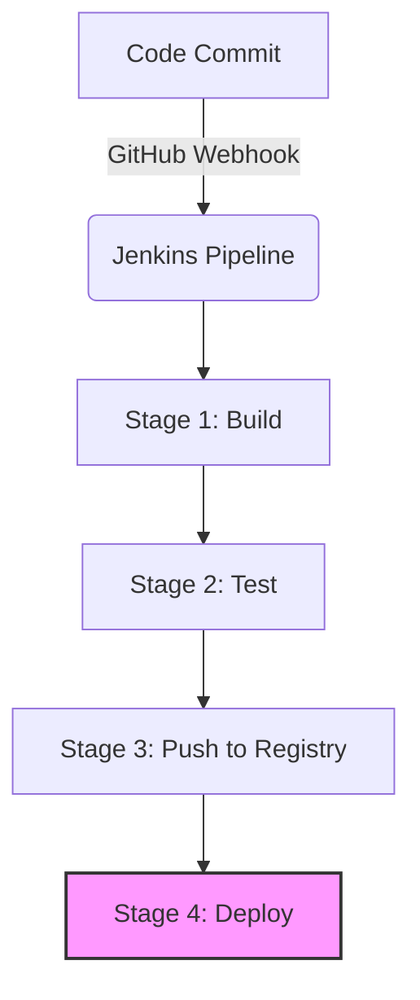

# 🏗️ Jenkins Declarative CI/CD Pipeline for Containerized Apps

This repository showcases a production-grade **Continuous Integration and Continuous Deployment (CI/CD)** workflow using a Jenkins Declarative Pipeline. It automates the lifecycle of a Node.js microservice—from code commit to containerized distribution.

## 🛠 Tech Stack
* **Orchestration:** Jenkins (Declarative Pipeline)
* **Containerization:** Docker
* **Runtime:** Node.js
* **Automation:** GitHub Webhooks (Event-driven CI)

## 📊 Pipeline Flow

The `Jenkinsfile` is architected into four high-availability stages:

## 🛠️ Pipeline Stages
1. **Build**

- Initializes the environment and prepares the application context for containerization.

2. **Test**

- Validates code quality and executes unit tests to ensure reliability before artifact creation.

3. **Push Image (Security Focus)**

- **Secure Auth**: Securely builds the Docker image and pushes it to a central registry.

- **Credential ID**: Utilizes docker-hub-creds via Jenkins Credentials Provider.

4. **Deploy**

- Implements the final deployment logic, ensuring the containerized application is running the latest verified build.

## 🔒 Security & Best Practices
- Credential Masking: Utilizes Jenkins credential management to handle Docker Hub secrets, ensuring no sensitive data is exposed in console logs or source code.

- Single-Touch Automation: Integrated with GitHub Webhooks to achieve fully hands-free builds upon every git push.

- Optimized Dockerfile: Employs modular layers and multi-stage build logic to reduce image size and optimize caching.

## 🚀 Setup Instructions
- Jenkins Configuration: Ensure the **Pipeline** and **Docker Pipeline** plugins are installed on your Jenkins controller.

- Credentials Setup: Add your Docker Registry credentials in Jenkins with the specific ID: docker-hub-creds.

- Webhook Integration: Set your Payload URL in GitHub (Repository Settings > Webhooks) to: http://<your-jenkins-url>/github-webhook/.
